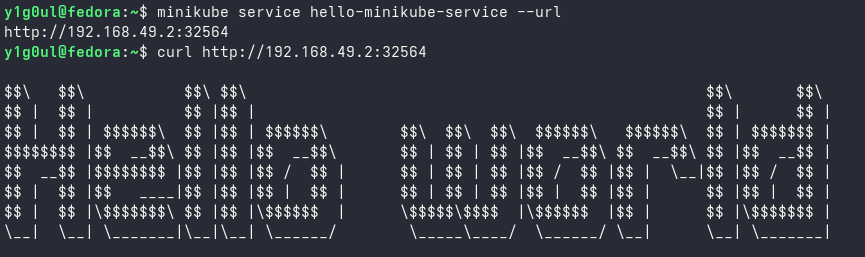

# Hello Minikube

Flask-приложение, упакованное в Docker и развёрнутое в локальном Kubernetes-кластере Minikube.

Приложение работает на порту `32777` и возвращает ASCII Hello World.

Docker Hub:

```text
y1g0ul/hello-minikube
```

Для `main` автоматически публикуются образы с тегами:

- `latest`
- `sha-<commit SHA>`

## Архитектура

<p align="center">
  
</p>

Deployment поддерживает две реплики приложения.

Service типа NodePort выбирает Pod по label `app: hello-minikube` и предоставляет к ним единую точку доступа.

## Запуск

Запустить Minikube:

```bash
minikube start --driver=docker
```

Развернуть приложение:

```bash
kubectl apply -f k8s/
```

Проверить состояние:

```bash
kubectl get deployments
kubectl get pods
kubectl get services
```

Получить адрес приложения:

```bash
minikube service hello-minikube-service --url
```

Проверить ответ:

```bash
curl <service-url>
```

## Docker

Сборка образа:

```bash
docker build -t y1g0ul/hello-minikube:v1.0.0 .
```

Локальный запуск:

```bash
docker run --rm -p 32777:32777 y1g0ul/hello-minikube:v1.0.0
```

## CI/CD

Для проекта настроен CI/CD через GitHub Actions.

При Pull Request в `main` Docker image собирается для проверки, но не публикуется в Docker Hub.

При push в `main`, если изменились файлы, влияющие на приложение или сборку контейнера:

1. GitHub-hosted runner собирает Docker image.
2. Image публикуется в Docker Hub с тегами `latest` и `sha-<commit SHA>`.
3. После успешной сборки запускается deploy job.
4. Deploy job выполняется на self-hosted runner, установленном на отдельной VM с Minikube.
5. Runner обновляет image Kubernetes Deployment.
6. Kubernetes выполняет rolling update двух реплик приложения.
7. Workflow ожидает успешного завершения rollout.

Схема процесса:

```text
git push
    ↓
GitHub Actions
    ↓
Docker build
    ↓
Docker Hub
    ↓
Self-hosted runner
    ↓
Minikube
    ↓
Kubernetes Deployment
    ↓
2 Pods
```

Для deployment используется image с тегом, содержащим полный SHA Git commit:

```text
y1g0ul/hello-minikube:sha-<commit SHA>
```

Это позволяет однозначно определить, какой Git commit сейчас развёрнут в Kubernetes.

Изменения документации, например `README.md` или файлов в `docs/`, не требуют сборки нового Docker image и не запускают deployment.

## Результат

<details>
<summary>Скриншоты</summary>

### Pods


### Deployment и Service


### Ответ приложения



</details>