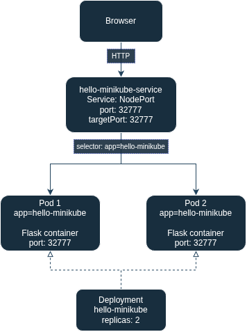
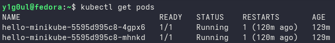
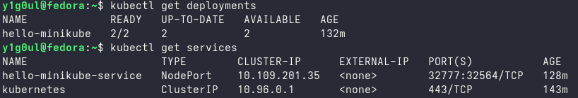
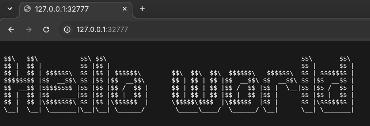
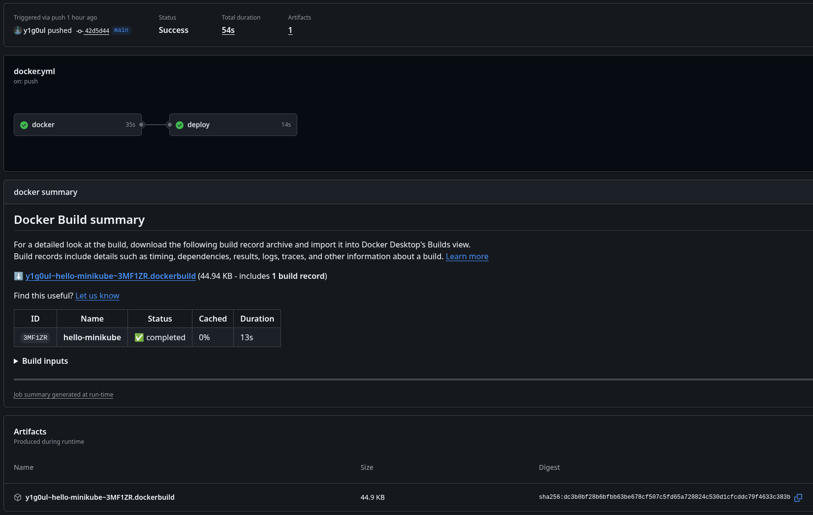

# Hello Minikube

Flask-приложение, упакованное в Docker и развёрнутое в локальном Kubernetes-кластере Minikube.

Приложение работает на порту `32777` и возвращает ASCII Hello World.

Docker Hub: [y1g0ul/hello-minikube](https://hub.docker.com/r/y1g0ul/hello-minikube).

Для `main` автоматически публикуются образы с тегами:

- `latest`
- `sha-<commit SHA>`

## Архитектура

<p align="center">
  
</p>

Deployment поддерживает две реплики приложения.

Service типа NodePort выбирает Pod по label `app: hello-minikube` и предоставляет к ним единую точку доступа.

## Запуск

Установить Docker, kubectl и Minikube, затем запустить кластер:

```bash
minikube start --driver=docker
```

Развернуть приложение:

```bash
kubectl apply -f k8s/
kubectl rollout status deployment/hello-minikube --timeout=120s
```

Для первого запуска манифест использует опубликованный образ `latest`. Настройка `imagePullPolicy: Always` заставляет Kubernetes проверять актуальный образ при каждом запуске контейнера.

Проверить состояние:

```bash
kubectl get deployments
kubectl get pods
kubectl get services
```

### Доступ при запуске Minikube на основном компьютере

На машине с Minikube запустить:

```bash
kubectl port-forward service/hello-minikube-service 32777:32777
```

Открыть в браузере `http://localhost:32777`.

### Доступ при запуске Minikube на виртуальной машине

В случае если Minikube работает на отдельной VM. Вместо предыдущей команды на основном компьютере запустить SSH-туннель вместе с `kubectl port-forward`:

```bash
ssh -L 32777:127.0.0.1:32777 USERNAME@IP \
  'kubectl port-forward service/hello-minikube-service 32777:32777'
```

## Docker

Сборка образа:

```bash
docker build -t y1g0ul/hello-minikube:latest .
```

Локальный запуск:

```bash
docker run --rm -p 32777:32777 y1g0ul/hello-minikube:latest
```

## CI/CD

Для проекта настроен CI/CD через GitHub Actions.

При Pull Request в `main`, затрагивающем приложение, Dockerfile, зависимости или настройки сборки, Docker image собирается для проверки, но не публикуется в Docker Hub.

При push в `main`, если изменились файлы, влияющие на приложение или сборку контейнера:

1. GitHub-hosted runner собирает Docker image.
2. Image публикуется в Docker Hub с тегами `latest` и `sha-<commit SHA>`.
3. После успешной сборки запускается deploy job.
4. Deploy job выполняется на self-hosted runner, установленном на отдельной VM с Minikube.
5. Runner применяет манифесты Service и Deployment, подставив в Deployment SHA-тег нового image.
6. Kubernetes выполняет rolling update двух реплик приложения.
7. Workflow ожидает успешного завершения rollout.

Если push в `main` меняет только манифесты в `k8s/`, сборка образа пропускается. Deploy job применяет манифесты и сохраняет image, который уже используется в Deployment. Если Deployment ещё не создан, используется `latest` из манифеста.

Каталог `k8s/` остаётся в `.dockerignore`: манифесты нужны при деплое, но не внутри Docker image.

Схема процесса:

```text
git push
    ↓
GitHub Actions
    ↓
Docker build
    ↓
Docker Hub
    ↓
Self-hosted runner
    ↓
Minikube
    ↓
Kubernetes Deployment
    ↓
2 Pods
```

Для deployment используется image с тегом, содержащим полный SHA Git commit:

```text
y1g0ul/hello-minikube:sha-<commit SHA>
```

Это позволяет однозначно определить, какой Git commit сейчас развёрнут в Kubernetes.

После деплоя через CI/CD в кластере используется SHA-тег, а в исходном манифесте для первого запуска указан `latest`. Последующие изменения манифестов применяются через CI/CD с сохранением текущего image, если новая сборка не нужна. Ручной `kubectl apply -f k8s/` переключит Deployment обратно на `latest`.

Обновление тега `latest` в Docker Hub само по себе не перезапускает работающие Pod. Для обновления вручную при использовании `latest` нужен `kubectl rollout restart deployment/hello-minikube`; CI/CD запускает обновление сменой SHA-тега.

Изменения документации, например `README.md` или файлов в `docs/`, не требуют сборки нового Docker image и не запускают deployment.

## Результат

<details>
<summary>Скриншоты</summary>

### Pods



### Deployment и Service



### Ответ приложения в браузере



### CI/CD



</details>

Отчёт с ответами на вопросы и результатами работы: [PDF](docs/DevOps_test.pdf)
